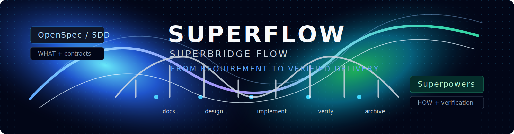

<p align="center">
  
</p>

<p align="center">
  <a href="https://www.npmjs.com/package/@chenmk/superflow"></a>
  <a href="https://www.npmjs.com/package/@chenmk/superflow"></a>
  <a href="https://www.npmjs.com/package/@chenmk/superflow"></a>
  <a href="https://github.com/BasketballNotFound-ManKun/superflow-cli/stargazers"></a>
  <a href="./LICENSE"></a>
  
</p>

<p align="center">
  <strong>把 OpenSpec/SDD 的合同约束和 Superpowers 的工程纪律，收束成一个可执行的交付工作流。</strong>
</p>

<p align="center">
  <a href="./README.md">English</a>
  ·
  <a href="#安装">安装</a>
  ·
  <a href="#工作流">工作流</a>
  ·
  <a href="#star-history">Star History</a>
</p>

# SuperBridge Flow

通用 SDD 开发工作流 CLI，支持 Claude Code、Codex 和 OpenCode。

SuperBridge Flow 不是简单“装两个工具”，而是把 OpenSpec/SDD 和
Superpowers 编排成一个有状态的研发流程：前者负责需求、合同和验收口径，
后者负责源码级设计、TDD 顺序、实现分工、review 和真实验证。

CLI 会把 SuperBridge Flow 技能、配套 hook/command 脚本整合为单一 npm 包，
自动部署到：

- Claude Code：`~/.claude/skills/`、`~/.claude/scripts/`，并注册 `~/.claude/settings.json` hook
- Codex：`~/.codex/skills/`、`~/.codex/hooks/`
- OpenCode：`.opencode/skills/`、`.opencode/commands/`、`.opencode/scripts/`
  或全局 `~/.config/opencode/`

## 亮点

- **9 类翻车场景，沉淀成门禁。** 我们见过的 AI 翻车——需求一次吞、字段漏查消费者、SQL 漂移、mock-only 报告、跨服务只看到"能调"……9 种典型形态都被固化成 guard，AI 想跳过都不行。
- **跨服务代码必须先答架构 6 问。** 涉及跨仓、跨服务、SDK、MQ、设备、回调、网关的改动，技术详设里必须先回答：owner 是谁、调用方向、新入口是否允许、禁止路径、证据锚点——答不全不让进入实现。
- **改字段之前先填"字段与状态反向影响"矩阵。** 任何 schema、状态、枚举的改动，必须枚举写入点、读取点、过滤点、派生 / 同步点、跨模块消费者、测试覆盖，还要列反向恢复场景（下线后重上线、旧值不可用但上游没传字段、历史脏数据被新过滤条件消费）。
- **6 条踩坑经验产品化，不是提醒是门禁。** 影响面要查全、业务语义 > 接口成功、禁止默认兜底、数据库收口、真实入口验证、代码与数据关系核实——每条绑定特定阶段和特定 hook，缺证据就阻断下一阶段。
- **5 个阶段 × 5+ 门禁脚本硬阻断。** `superflow-guard.sh` + `superflow-hook-guard.sh` + `superflow-contract-hooks.sh` + `superflow-sql-sync-hook.py` + `superflow-test-report-lint.py` + `superflow-verify-integration.sh`。没有 handoff hash 不进实现，没有真实入口证据不写"通过"。
- **用 handoff + state + sha256 治上下文漂移。** 长会话压缩、切 agent、并行 worktree——`.sdd/handoff/sdd-context.{md,json}` + sha256 + `.sdd/state.yaml` 让 Worker / Tester / Reviewer 始终基于同一份上下文，hash 对不上的旧 prompt 自动被 guard 拒绝。
- **用户只说一句话，流水线跑 9 步。** 不用写复杂 prompt：`> 用 SuperFlow 处理这个需求` 触发 clarify → docs → design → implement → verify → archive。阶段推进、guard、hash、hook 全是流程强制，不靠用户自觉。
- **`superflow check` 一键诊断文档缺口。** 对照 13 项必备 SDD 文件逐项核验，缺失即 exit 1。再也不会进了 implement 才发现 proposal 没写——check 在 docs 阶段就拦住你。
- **`superflow config` 按需调整审查强度。** `--review-mode off|standard|thorough` 控制代码审查深度；`--auto-transition` 控制阶段自动流转。不同改动匹配不同强度，省 token 不省质量。
- **启动自动检查新版本。** 每次执行 superflow 命令，后台静默对比 npm registry。发现新版本时 stderr 输出升级提示，不阻塞、不拖慢。

## 工作流

```text
docs -> design -> implement -> verify -> archive
```

| 阶段 | 主责 | 产物 |
|------|------|------|
| `docs` | OpenSpec/SDD | 需求、接口、数据库、测试和验收合同 |
| `design` | Superpowers | 源码级技术详设、影响面分析和 TDD 计划 |
| `implement` | Superpowers + SuperBridge Flow | 分批任务 prompt、review 门禁和执行状态 |
| `verify` | SuperBridge Flow hooks | 有证据的测试报告、真实入口和联调校验 |
| `archive` | OpenSpec/SDD | 归档后的 spec 状态和生命周期闭环 |

## 安装

```bash
npm install -g @chenmk/superflow
```

完整安装、初始化和日常使用教程见 [INSTALL.md](./INSTALL.md)。

## 快速开始

```bash
# 交互式选择 Claude Code / Codex / OpenCode（可多选）
superflow init

# 非交互模式，默认同时安装 Claude Code + Codex
superflow init --yes

# 显式安装 OpenCode
superflow init --agent opencode

# 同时安装 Claude Code + Codex + OpenCode
superflow init --agent all

# 跳过 hook 注册（手工管理）
superflow init --no-hooks

# 只打印计划不执行
superflow init --dry-run

# 从失败步骤继续
superflow init --resume

# 验证安装
superflow doctor
```

语言也可以全局切换：

```bash
# 查看英文 CLI help
superflow --language en --help

# 当前 shell 默认使用英文提示
export SUPERFLOW_LANG=en
superflow init
```

## SDD 分工

- OpenSpec/SDD 负责 WHAT 和合同：需求、API、DB、SQL、字段语义、tests、真实入口验收和质量门禁。
- Superpowers 负责 HOW：源码级技术详设、TDD/RED 顺序、团队分工、worktree/端口并行、review/tester 编排和验证闭环。
- 完整流程是 `docs -> design -> implement -> verify -> archive`。Superpowers 技术详设落到 `docs/superpowers/specs/*-technical-design.md`，并记录到 `.sdd/state.yaml` 的 `technical_design`，避免长会话压缩后漂移。
- Codex 侧通常用自然语言或 `$superflow-pipeline` 触发；Claude Code 侧可以直接用 `/superflow-pipeline`、`/superflow-docs`、`/superflow-design` 等 slash command。
- 飞书、语雀等在线文档读取工具不内置在 SuperBridge Flow CLI 中；可自行用 `lark-cli` 等外部工具读取，再通过 `/superflow-pipeline` 或 `$superflow-pipeline` 分段分析指定小节。

## 命令

| 命令 | 说明 |
|------|------|
| `superflow init` | 一站式安装；交互终端中可多选 Claude Code / Codex / OpenCode |
| `superflow init --yes` | 非交互安装，默认 `--agent both` |
| `superflow init --agent opencode` | 安装 OpenCode skills、commands、scripts 和 rules |
| `superflow init --agent all` | 同时安装 Claude Code + Codex + OpenCode |
| `superflow init --dry-run` | 只打印计划不执行 |
| `superflow init --resume` | 从失败步骤继续 |
| `superflow init --no-hooks` | 只装技能 + 脚本，跳过 Codex/Claude hook 注册 |
| `superflow init --no-openspec-init` | 跳过当前项目 OpenSpec 原生初始化 |
| `superflow doctor` | 诊断 CLI / 第三方 / 脚本 / skills |
| `superflow doctor --agent codex` | 只诊断 Codex 侧 |
| `superflow --language en --help` | 查看英文 CLI help |
| `superflow scan --language en` | 重新生成英文项目上下文模板 |
| `superflow clarify [feature]` | 校验 SuperBridge Flow clarify 阶段技能部署 |
| `superflow docs [change]` | 校验 SuperBridge Flow docs 阶段技能部署 |
| `superflow design [change]` | 校验 SuperBridge Flow design 阶段技能部署 |
| `superflow implement [task]` | 校验 SuperBridge Flow implement 阶段技能部署 |
| `superflow pipeline` | 校验 SuperBridge Flow pipeline 阶段技能部署 |
| `superflow check <change>` | 对照 13 项必备文件清单检查文档完整性 |
| `superflow config <change> --review-mode <mode>` | 设置代码审查强度（off/standard/thorough） |
| `superflow config <change> --auto-transition <bool>` | 控制阶段自动流转（true/false） |
| `superflow status` | 展示所有 active change 的阶段、任务、文档缺口 |
| `superflow update --with-package` | 更新 superflow 自身和 openspec/superpowers 依赖 |

## 系统支持

- macOS 10.15+
- Linux（Ubuntu 20.04+ / 其它主流发行版）
- Windows 10+（CLI 本体支持；hook 脚本需要 Git Bash 或兼容 shell）

## 依赖

- Node.js 20+
- Claude Code、Codex 或 OpenCode（按 `--agent` 选择）
- 第三方（`superflow init` 自动装）：
  - openspec CLI（硬依赖，npm 全局）并在当前项目执行 `openspec init --tools ...`
  - superpowers（Claude Code / Codex 为硬依赖；OpenCode 侧通过已部署 skills/commands 使用流程）
  - understand-anything（尽力安装，失败只警告）
  - api-doc-changelog（辅助 skill，复制到目标 agent skills 目录）

## 自动检查更新

注册 hook 后，Superflow 会在新会话开始时轻量检查核心依赖更新：

- `@chenmk/superflow`
- `@fission-ai/openspec`
- Claude Code / Codex 的 Superpowers 插件；OpenCode 侧的 SuperBridge Flow assets

推荐策略是“自动检查，手动更新”：默认只提示，不自动安装；执行
`superflow update --with-package` 才会统一更新。
同一会话只检查一次，并且默认至少间隔 6 小时才真正访问 npm/plugin 源。

```bash
# 默认：只检查并提示
export SUPERFLOW_AUTO_UPDATE=check

# 关闭自动检查
export SUPERFLOW_AUTO_UPDATE=0

# 个人机器可选：检查到新版本后自动安装
export SUPERFLOW_AUTO_UPDATE=apply

# 调整最小检查间隔，默认 21600 秒（6 小时）
export SUPERFLOW_UPDATE_MIN_INTERVAL_SECONDS=21600
```

## Star History

下图由 Star History 根据 GitHub 公开 star 数据动态生成。仓库保持 private
时，第三方服务通常读不到完整数据；切换为 public 后会正常展示趋势。

[](https://star-history.com/#basketballnotfound-mankun/superflow-cli&Date)

[打开 Star History 趋势图](https://star-history.com/#basketballnotfound-mankun/superflow-cli&Date)

## 许可证

MIT
