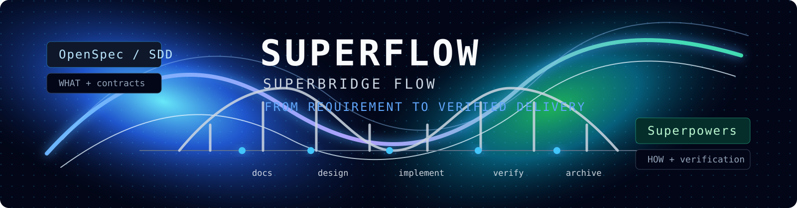
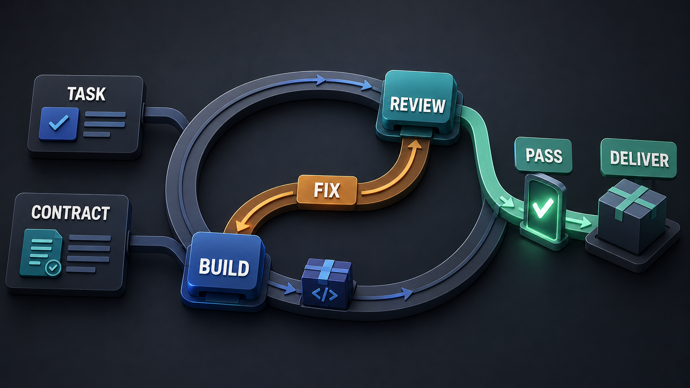

<p align="center">
  
</p>

<p align="center">
  <a href="https://www.npmjs.com/package/@chenmk/superflow"></a>
  <a href="https://www.npmjs.com/package/@chenmk/superflow"></a>
  <a href="https://www.npmjs.com/package/@chenmk/superflow"></a>
  <a href="https://github.com/BasketballNotFound-ManKun/superflow-cli/stargazers"></a>
  <a href="./LICENSE"></a>
  
</p>

<p align="center">
  <strong>把 OpenSpec/SDD 的合同约束和 Superpowers 的工程纪律，收束成一个可执行的交付工作流。</strong>
</p>

<p align="center">
  <a href="./README.md">English</a>
  ·
  <a href="#安装">安装</a>
  ·
  <a href="#工作流">工作流</a>
  ·
  <a href="#star-history">Star History</a>
</p>

# SuperBridge Flow

通用 SDD 开发工作流 CLI，支持 Claude Code 和 Codex。

SuperBridge Flow 不是简单“装两个工具”，而是把 OpenSpec/SDD 和
Superpowers 编排成一个有状态的研发流程：前者负责需求、合同和验收口径，
后者负责源码级设计、TDD 顺序、实现分工、review 和真实验证。

CLI 会把 SuperBridge Flow 技能、配套 hook/command 脚本整合为单一 npm 包，
自动部署到：

- Claude Code：`~/.claude/skills/`、`~/.claude/scripts/`，并注册 `~/.claude/settings.json` hook
- Codex：`~/.codex/skills/`、`~/.codex/hooks/`

## 亮点

- **双 Agent 托管到真实交付。** 当前 Host Agent 直接监督，另一个 Agent 在一次不限制工具
  轮数的 CLI 会话中持续开发、启动和验证，完成后主动返回结构化结果；只有评审整改、进程异常
  或人工恢复才创建后续会话。工作区与落盘 finding 负责交接，默认最多 5 轮评审、7 次执行、
  12 次总调用。
  状态和证据全部落盘，终端或网络中断后可恢复，最终停在等待 Git 批准。
- **9 类翻车场景，沉淀成门禁。** 我们见过的 AI 翻车——需求一次吞、字段漏查消费者、SQL 漂移、mock-only 报告、跨服务只看到"能调"……9 种典型形态都被固化成 guard，AI 想跳过都不行。
- **跨服务代码必须先答架构 6 问。** 涉及跨仓、跨服务、SDK、MQ、设备、回调、网关的改动，技术详设里必须先回答：owner 是谁、调用方向、新入口是否允许、禁止路径、证据锚点——答不全不让进入实现。
- **改字段之前先填"字段与状态反向影响"矩阵。** 任何 schema、状态、枚举的改动，必须枚举写入点、读取点、过滤点、派生 / 同步点、跨模块消费者、测试覆盖，还要列反向恢复场景（下线后重上线、旧值不可用但上游没传字段、历史脏数据被新过滤条件消费）。
- **6 条踩坑经验产品化，不是提醒是门禁。** 影响面要查全、业务语义 > 接口成功、禁止默认兜底、数据库收口、真实入口验证、代码与数据关系核实——每条绑定特定阶段和特定 hook，缺证据就阻断下一阶段。
- **5 个阶段 × 5+ 门禁脚本硬阻断。** `superflow-guard.sh` + `superflow-hook-guard.sh` + `superflow-contract-hooks.sh` + `superflow-sql-sync-hook.py` + `superflow-test-report-lint.py` + `superflow-verify-integration.sh`。没有 handoff hash 不进实现，没有真实入口证据不写"通过"。
- **用 handoff + state + sha256 治上下文漂移。** 长会话压缩、切 agent、并行 worktree——`.sdd/handoff/sdd-context.{md,json}` + sha256 + `.sdd/state.yaml` 让 Worker / Tester / Reviewer 始终基于同一份上下文，hash 对不上的旧 prompt 自动被 guard 拒绝。
- **用户只说一句话，流水线跑 9 步。** 不用写复杂 prompt：`> 用 SuperFlow 处理这个需求` 触发 clarify → docs → design → implement → verify → archive。阶段推进、guard、hash、hook 全是流程强制，不靠用户自觉。
- **`superflow check` 分级诊断交付就绪度。** `files` 检查必备文件，`docs` 增加逐 Prompt 链接、多轮评审和复杂流程图检查，`coding-ready` 再执行环境预检及 docs/design/implement 全门禁，并生成绑定当前 handoff hash 的可编码凭证。
- **`superflow config` 按需调整审查强度。** `--review-mode off|standard|thorough` 控制代码审查深度；`--auto-transition` 控制阶段自动流转。不同改动匹配不同强度，省 token 不省质量。
- **启动自动检查新版本。** 每次执行 superflow 命令，后台静默对比 npm registry。发现新版本时 stderr 输出升级提示，不阻塞、不拖慢。

## 托管交付：有上限的评审—整改闭环



你可以给 Superflow 一条简单开发任务，也可以给它一份冻结的 Superflow / SDD
合同。对端 Agent 负责实现和验证；当前正在与你对话的 Host 负责审查工作区、门禁和证据。

```text
简单任务或冻结合同
        ↓
对端 Agent 实现并验证
        ↓
当前 Host 审查源码、门禁与证据
   ├─ 未通过 → finding + 历史证据 → 对端 Agent 整改 ↺
   └─ 通过 → 进入交付就绪状态 → 等待你决定 Git / 发布
```

这是一个刻意有上限的工程闭环，不是无人看管的 Agent 群：

- Host 只负责语义评审；对端只负责改源码和做验证，职责不混淆。
- 评审未通过时，系统会带着精确 finding 和已经有效的证据回到对端；它在当前工作区整改，不会拿一份空 Prompt 从头猜。
- 默认最多 5 轮 Host 评审、7 次对端调用、12 次总调用；账本让中断后的恢复可审计。
- 通过只表示满足冻结的交付合同，不表示“绝对无风险”；系统也绝不会自动提交、推送、部署或写生产。

完整角色边界、状态流转与恢复规则见[托管交付闭环说明](./docs/managed-delivery-loop.md)。

## 工作流

```text
docs -> design -> implement -> verify -> archive
```

| 阶段        | 主责                           | 产物                                   |
| ----------- | ------------------------------ | -------------------------------------- |
| `docs`      | OpenSpec/SDD                   | 需求、接口、数据库、测试和验收合同     |
| `design`    | Superpowers                    | 源码级技术详设、影响面分析和 TDD 计划  |
| `implement` | Superpowers + SuperBridge Flow | 分批任务 prompt、review 门禁和执行状态 |
| `verify`    | SuperBridge Flow hooks         | 有证据的测试报告、真实入口和联调校验   |
| `archive`   | OpenSpec/SDD                   | 归档后的 spec 状态和生命周期闭环       |

## 安装

```bash
npm install -g @chenmk/superflow
# 或本地源码：
# git clone https://github.com/.../superflow-cli && cd superflow-cli && bash install.sh
```

完整安装、初始化和日常使用教程见 [INSTALL.md](./INSTALL.md)。

从源码执行 `bash install.sh` 时，会检测本机已有的 Codex、Claude，并一次完成
CLI、Skills/Hooks 与对应托管 MCP 注册；安装后重启检测到的 Agent 即可。

> **💡 装完即全局生效，无需逐项目 init**：`npm install -g @chenmk/superflow`（或 `bash install.sh`）会自动把 superflow hooks 注册到 `~/.claude/settings.json`（全局），**本机上所有项目仓库**都获得 superflow 守门。钩子内部靠 `.sdd-enforced` 标记懒激活（没跑 `superflow clarify` 之前所有钩子静默放行，零干扰）。
>
> 只有需要项目级产物（OpenSpec change 目录 / `.sdd/` 任务文件 / 团队约定）时，才在项目根目录跑 `superflow init`。**绝大多数项目不需要这一步**——hooks 已经在全局生效了。

## 快速开始

> ⚠️ `superflow init` **通常不需要再跑**——参见上文「装完即全局生效」。下面这些命令只在你想加项目级产物或显式重置时使用。

```bash
# 交互式选择 Claude Code / Codex（可多选）
superflow init

# 非交互模式，默认同时安装 Claude Code + Codex（默认 --scope global）
superflow init --yes

# 跳过 hook 注册（手工管理）
superflow init --no-hooks

# 只打印计划不执行
superflow init --dry-run

# 从失败步骤继续
superflow init --resume

# 验证安装
superflow doctor
```

语言也可以全局切换：

```bash
# 查看英文 CLI help
superflow --language en --help

# 当前 shell 默认使用英文提示
export SUPERFLOW_LANG=en
superflow init
```

托管一个 implementation prompt、OpenSpec change 或简单开发任务：

```bash
superflow pipeline "<prompt 路径、change 目录或任务>" --managed \
  --project "<项目根目录>" --supervisor current --executor peer
```

语言会冻结进任务合同；执行 Prompt、评审、账本、报告、通知和恢复轮次保持一致。
执行 Agent 每轮使用全新短会话；当前 Host Agent 直接评审，不再由后台启动第二个同名
CLI。首轮自动使用冻结任务 Prompt，后续每轮生成压缩交接包，因此旧会话或新会话均能从
当前工作区、剩余任务和完整评审意见继续。任务提示 `external_supervisor_review_required`
后，提交结构化评审并恢复：

```bash
superflow pipeline --resume-task <任务编号> --submit-host-review <review.json>
```

### 在主 Agent 中直接交互（MCP，推荐）

安装 Superflow 后，将本地 stdio MCP 注册到 Codex、Claude：

```bash
superflow mcp install --agent both
```

重启主 Agent 会话后，用户继续直接与当前 Codex/Claude 对话。主 Agent 通过 MCP
创建和监督任务，Superflow 后台只启动对端研发 Agent：

- `superflow_managed_start`：冻结任务并启动研发执行；固定为 `external_host`。
- `superflow_managed_status` / `superflow_managed_list`：读取状态、调用账本和证据。
- `superflow_managed_wait`：默认用 240 秒兼容传输窗口，支持长调用的 Host 可显式提高到
  12 小时；窗口超时只按 `latestSequence` 紧凑续接。活动请求用标准 MCP progress
  notification 展示健康进度，连续两个无有效里程碑才返回语义监督。
- `superflow_managed_message`：把用户补充、环境授权和澄清写入当前运行边界或下一轮交接。
- `superflow_managed_authorize_executor`：冻结任务级仓库范围和源码处理授权，不绕过宿主 DLP。
- `superflow_managed_pause` / `superflow_managed_resume`：中断当前研发 Agent、持久化暂停并恢复。
- `superflow_managed_submit_review`：当前主 Agent 一次性提交全量结构化评审。
- `superflow_managed_record_validation`：记录环境/发布证据并重算三段交付状态。

MCP 模式禁止启动嵌套 Supervisor CLI。当前主 Agent 的对话、监督和评审不计入
Superflow 后台 Agent 调用；只有研发 Agent 的真实调用计入执行预算。任务通过后按实际
进度进入 `environment_validation_blocked`、`local_delivery_ready` 或 `release_ready`，
MCP 不自动 commit、push、部署或写生产环境。

托管默认使用三层止损：同类机械交付错误只自动整改一次、累计最多两次自动整改后转当前
Host；累计 200 万 Token 单位后停止下一次调用；单轮出现 3 次及以上权限拒绝时直接交由
Host 判断。不同模型供应商的美元计价不可比，因此默认不使用美元预算熔断，也不向 Claude
传 `--max-budget-usd`。changedFiles、基础 taskEvidence 和验证类别由 Runner 根据工作区与
真实命令补全，不再消耗完整研发轮次修 JSON 格式。

Claude Executor 默认不传 `--max-turns` 或 `--max-budget-usd`，不会因为固定工具步数或不准确
的美元估值拆断正常研发。默认连续 60 分钟完全无输出或单次执行达到 2 小时才终止进程；
连续供应商错误、Token/调用预算、安全边界和用户暂停仍会止损。启动前会把可安全发现的
Java、Maven、Node 和 npm 可执行路径写入执行策略，减少研发 Agent 重复寻找环境。
为避免 1M 上下文在数百工具轮次中持续放大输入 Token，Claude Executor 默认按 200K 有效
窗口、70% 阈值提前自动压缩；用户显式 Claude 环境配置优先，压缩后会重读冻结 Prompt 和
handoff。

检查或移除配置：

```bash
superflow mcp status --agent both
superflow mcp remove --agent both
```

MCP 是主 Agent 与本地托管状态机的通信通道，不会把 Superflow 变成第三个模型。
已有任务 Prompt 使用完整合同；直接输入普通工程需求时自动生成标准执行合同；一句简单
需求也会先生成最小实现与验证任务，不会以空任务清单直接启动研发 Agent。
宿主仍可能对外部研发 Agent 的模型供应商执行数据披露策略；本机完全访问权限与供应商
信任是两类独立门禁。

设计与实战证据：

- [跨 Agent 托管实现方案](docs/cross-agent-development-implementation-plan.md)
- [托管功能设计原则](docs/managed-work-design-principles.md)
- [托管 Agent 通信协议](docs/managed-agent-protocol.md)

## SDD 分工

- OpenSpec/SDD 负责 WHAT 和合同：需求、API、DB、SQL、字段语义、tests、真实入口验收和质量门禁。
- Superpowers 负责 HOW：源码级技术详设、TDD/RED 顺序、团队分工、worktree/端口并行、review/tester 编排和验证闭环。
- 完整流程是 `docs -> design -> implement -> verify -> archive`。Superpowers 技术详设落到 `docs/superpowers/specs/*-technical-design.md`，并记录到 `.sdd/state.yaml` 的 `technical_design`，避免长会话压缩后漂移。
- Codex 侧通常用自然语言或 `$superflow-pipeline` 触发；Claude Code 侧可以直接用 `/superflow-pipeline`、`/superflow-docs`、`/superflow-design` 等 slash command。
- 只说一句话触发总路由时，遇到需要业务负责人选择的关键分歧，SuperFlow 会在 clarify 阶段自动进入深度澄清：先查代码和已有资料能确认的事实，再一次只问一个决策问题，并给出推荐方案与影响。明确、范围小的改动不会被强行拉进问答流程。
- 飞书、语雀等在线文档读取工具不内置在 SuperBridge Flow CLI 中；可自行用 `lark-cli` 等外部工具读取，再通过 `/superflow-pipeline` 或 `$superflow-pipeline` 分段分析指定小节。

## 命令

| 命令                                                         | 说明                                                        |
| ------------------------------------------------------------ | ----------------------------------------------------------- |
| `superflow init`                                             | 一站式安装；交互终端中可多选 Claude Code / Codex |
| `superflow init --yes`                                       | 非交互安装，默认 `--agent both`                             |
| `superflow init --dry-run`                                   | 只打印计划不执行                                            |
| `superflow init --resume`                                    | 从失败步骤继续                                              |
| `superflow init --no-hooks`                                  | 只装技能 + 脚本，跳过 Codex/Claude hook 注册                |
| `superflow init --no-openspec-init`                          | 跳过当前项目 OpenSpec 原生初始化                            |
| `superflow doctor`                                           | 诊断 CLI / MCP / 第三方 / 脚本 / skills                     |
| `superflow doctor --agent codex`                             | 只诊断 Codex 侧                                             |
| `superflow doctor --agent both --language en`                | 英文诊断 Codex、Claude 与 MCP 路径                           |
| `superflow --language en --help`                             | 查看英文 CLI help                                           |
| `superflow scan --language en`                               | 重新生成英文项目上下文模板                                  |
| `superflow clarify [feature]`                                | 校验 SuperBridge Flow clarify 阶段技能部署                  |
| `superflow docs [change]`                                    | 执行 docs 门禁并校验阶段技能                                |
| `superflow design [change]`                                  | 校验 SuperBridge Flow design 阶段技能部署                   |
| `superflow implement [change]`                               | 生成当前 Coding Ready 凭证后进入实现阶段                    |
| `superflow pipeline`                                         | 校验 SuperBridge Flow pipeline 阶段技能部署                 |
| `superflow pipeline "<任务>" --managed --project <目录>`     | 执行 Agent 短会话开发，当前 Host Agent 直接评审             |
| `superflow check <change> --level files\|docs\|coding-ready` | 分级检查文件、文档交付或可直接编码就绪度                    |
| `superflow config <change> --review-mode <mode>`             | 设置代码审查强度（off/standard/thorough）                   |
| `superflow config <change> --auto-transition <bool>`         | 控制阶段自动流转（true/false）                              |
| `superflow status`                                           | 展示所有 active change 的阶段、任务、文档缺口               |
| `superflow eval <taskPath> [--json]`                         | 离线统计托管质量、调用、Token、缓存与耗时                   |
| `superflow update --with-package`                            | 更新 superflow 自身和 openspec/superpowers 依赖             |

## 系统支持

- macOS 10.15+
- Linux（Ubuntu 20.04+ / 其它主流发行版）
- Windows 10+（CLI 本体支持；hook 脚本需要 Git Bash 或兼容 shell）

托管运行时会在 Windows 解析 Agent 的 `.exe/.cmd/.bat` shim，并在暂停或超时时终止完整
Agent 进程树；macOS/Linux 继续使用独立进程组。三端均不通过通用 shell 拼接启动命令。

## 依赖

- Node.js 20+
- Claude Code、Codex（按 `--agent` 选择）
- 第三方（`superflow init` 自动装）：
  - openspec CLI（硬依赖，npm 全局）并在当前项目执行 `openspec init --tools ...`
  - superpowers（Claude Code / Codex 为硬依赖；Codex 自动安装官方
    `superpowers@openai-api-curated`，确保包含验证、代码评审和分支收尾三个强制技能）
  - understand-anything（尽力安装，失败只警告）
  - api-doc-changelog（辅助 skill，复制到目标 agent skills 目录）

## 自动检查更新

注册 hook 后，Superflow 会在新会话开始时轻量检查核心依赖更新：

- `@chenmk/superflow`
- `@fission-ai/openspec`
- Claude Code / Codex 的 Superpowers 插件

推荐策略是“自动检查，手动更新”：默认只提示，不自动安装；执行
`superflow update --with-package` 才会统一更新。
同一会话只检查一次，并且默认至少间隔 6 小时才真正访问 npm/plugin 源。

```bash
# 默认：只检查并提示
export SUPERFLOW_AUTO_UPDATE=check

# 关闭自动检查
export SUPERFLOW_AUTO_UPDATE=0

# 个人机器可选：检查到新版本后完整更新包、Skills、Hooks、规则、脚本和托管 MCP
export SUPERFLOW_AUTO_UPDATE=apply

# 调整最小检查间隔，默认 21600 秒（6 小时）
export SUPERFLOW_UPDATE_MIN_INTERVAL_SECONDS=21600
```

`apply` 会在包升级后重新进入新版本 CLI，统一刷新所有已检测到的 Agent 资产和 MCP 注册。
任一步失败都会保留日志和下次会话重试资格，不会把半升级状态标记为成功。升级完成后需要
重启 Agent，旧会话不会热加载新的 MCP 运行时。

## Star History

下图由 Star History 根据 GitHub 公开 star 数据动态生成。仓库保持 private
时，第三方服务通常读不到完整数据；切换为 public 后会正常展示趋势。

[](https://star-history.com/#basketballnotfound-mankun/superflow-cli&Date)

[打开 Star History 趋势图](https://star-history.com/#basketballnotfound-mankun/superflow-cli&Date)

## 许可证

MIT
