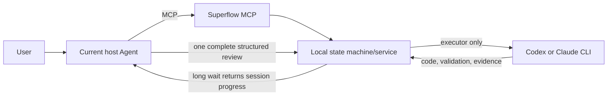

# Superflow Cross-Agent Managed Delivery

> Implementation baseline: 2026-07-27. This document describes only the current MCP topology; nested supervisor CLIs are retired.

## 1. Goal and topology

The user talks only to the current host Agent. The host freezes the goal, supervises, independently reviews, and decides delivery quality. A lower-cost executor reads local repositories, implements, builds, tests, starts applications, invokes real HTTP endpoints, runs browser E2E, and cleans up its processes. Superflow is a local MCP state machine, not a third AI Agent.



No second reviewer CLI is launched. Host review does not consume background Agent invocation budget.

## 2. Support matrix

| Capability | Codex | Claude |
|---|---:|---:|
| Skills | supported | supported |
| MCP host registration | supported | supported |
| Background executor | supported | supported |
| Local real smoke test | verified | verified |

The host and executor must differ; the pair is Codex ↔ Claude.

## 3. MCP entry points

```bash
superflow mcp install --agent codex
superflow mcp install --agent claude
```

Tools cover start, executor authorization, list/status, long wait, user messages, pause/resume, host review submission, and environment/release validation recording. No tool automatically commits, pushes, deploys, executes SQL, or writes production data.

## 4. Frozen first prompt

When the user says to follow a task-prompt document, the host must pass that document or OpenSpec change absolute path as `request`; it must not replace the document with a summary. The resolver also extracts one existing path from a full user sentence.

- the implementation prompt is copied to `source-prompt.md`;
- original path and SHA-256 are persisted;
- a change directory resolves `.sdd/state.yaml` → `implementation_prompt`;
- OpenSpec `tasks.md` is rejected as an execution prompt;
- the MCP start result exposes the frozen path and hash for host confirmation.

Every repair uses a fresh short executor session and a persisted `executor-handoff-N.md`, not an indefinitely resumed chat history.

## 5. Repair continuity

Each handoff contains the frozen prompt/hash, three-track task progress, every current finding with evidence/risk/fix/checks, the latest 20 user messages, current diff stat, partial-workspace changes, and the recent report. The runner combines these facts automatically; the host submits structured findings instead of rewriting the whole task prompt.

## 6. Shared completion policy

OpenSpec work recognizes only:

- `[local_required]` for source, tests, and local runtime checks;
- `[environment_required]` for named test/runtime environments;
- `[release_required]` for DBA, SRE, release-window, and sign-off work.

Untagged work is always local. Free-form Blocker/owner prose cannot downgrade local work into an external prerequisite. The Runner derives baseline evidence from task IDs, real changes, evidence paths, and successful commands; executors add `taskEvidence` only when a task needs distinct proof.

Delivery uses three independent progress tracks and terminal states:

- `environment_validation_blocked`: local source is ready, environment checks remain;
- `local_delivery_ready`: local and environment work are ready, release work remains;
- `release_ready`: all structured work is signed off.

None of these states grants Git, deployment, SQL, or production-write permission.

## 7. Mechanical validation gates

Engineering work needs at least two successful evidence categories. Spring Boot requires application startup and a real HTTP invocation. Frontend page or permission changes require frontend startup and Playwright/Cypress real-browser E2E. Controller/DTO plus frontend-request changes require backend Controller/MockMvc and frontend request-contract tests. Frontend API registration/export changes require an API export snapshot/call-resolution regression. Large existing-file reductions require a call-site audit.

Named MySQL, Testcontainers, browser, and real-service gates cannot be closed by H2, mocks, stubs, or static inspection.

## 8. Host review

At `waiting_for_host_review`, the host reads the frozen prompt, referenced documents, real diff, raw logs, and report; actually runs `openspec instructions apply`; reverse-checks newly checked tasks against evidence/diff/commands; and reports every material finding in one round. Review fingerprints are scoped to executor-declared changed paths, so unrelated changes do not invalidate a review while reviewed-file drift still does.

## 9. Waiting, notification, and observability

`superflow_managed_wait` waits locally for up to 12 hours by default. Ordinary progress does not wake the host; review, human action, provider change, pause, and terminal delivery do. `wakeOnProgress=true` is explicit opt-in. Progress is shown only in the host conversation; Superflow does not send macOS notifications.

Generic stdio MCP cannot create a new host-model turn while the host has no active wait call. The host therefore keeps one long blocking wait instead of model-driven polling; user notification channels remain a separate future design.

State records model/tool/workspace/approval phases, actual model, init tools/plugins, tool uses, last output/progress/reason, elapsed and deadline values, workspace diff evidence, executor tokens/cost, and host usage when supplied. Missing host usage remains null and is never estimated.

## 10. Provider, session, and pause behavior

- temporary 429/529/overloaded failures are credited outside business repair budget;
- three consecutive temporary failures open the circuit;
- Token Plan, 2056, quota, billing, and payment failures enter `waiting_for_provider_change` and never auto-retry;
- each repair uses a fresh short session while prior IDs remain auditable;
- Claude uses bare mode, explicit prompt/policy files, tools plus allowedTools, dontAsk, stream JSON, max turns, and max cost;
- pause terminates the current executor and persists `paused`; the executor still owns business processes it started.

## 11. Private repository boundary

MCP removes source-copying by the host: the local executor reads the frozen repositories itself. Start records repository scope and task-scoped informed consent. Consent, full-disk access, and MCP do not bypass organization tenant DLP. A host denial is preserved as a blocker until a trusted channel is available.

## 12. External validation still required

- Exact host tokens depend on host-provided usage events.
- Providers rarely expose a portable balance probe; permanent error codes are used for immediate circuit breaking when preflight is unavailable.
- Only the host/organization can decide whether a provider is trusted by tenant DLP.

## 13. Key files

| File | Responsibility |
|---|---|
| `src/mcp/server.ts` | MCP tools and host instructions |
| `src/domains/managed-work/input.ts` | prompt-path recognition |
| `src/domains/managed-work/completion-policy.ts` | task categories and completion decision |
| `src/domains/managed-work/verification-policy.ts` | browser, contract, and rewrite gates |
| `src/domains/managed-work/runner.ts` | executor, review, evidence, states, errors |
| `src/platform/agent-process.ts` | Codex/Claude invocation and telemetry |
| `assets/scripts/superflow-managed-work-check.mjs` | final integrity check |
