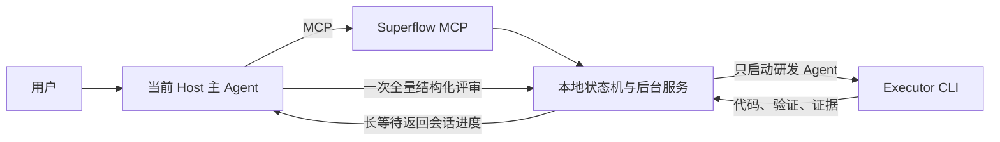
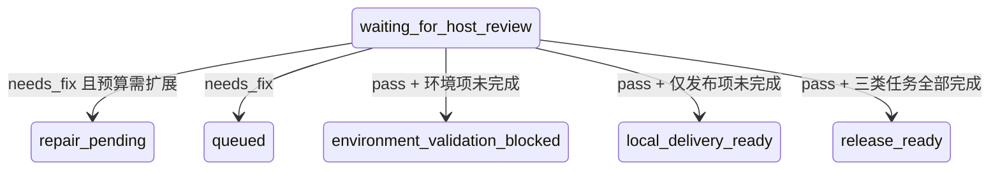

# Superflow 跨 Agent 托管实现方案

> 当前实现基线：2026-07-27。本方案只描述现行 MCP 编排，不包含已退役的嵌套 Supervisor CLI。

## 1. 产品目标

用户只与当前主 Agent 对话。主 Agent负责冻结目标、监督、独立评审和交付裁决；相对低成本
的研发 Agent 负责读取本地仓库、编码、构建、测试、启动应用、真实接口调用、页面 E2E 和
进程善后。Superflow 是本地 MCP 状态机，不是第三个 AI Agent。

## 2. 支持矩阵

| 能力 | Codex | Claude |
|---|---:|---:|
| Skills | 支持 | 支持 |
| MCP Host 注册 | 支持 | 支持 |
| 后台研发 Executor | 支持 | 支持 |
| 本机真实冒烟 | 已验证 | 已验证 |

主 Agent和研发 Agent不得相同，固定为 Codex ↔ Claude。

## 3. 唯一拓扑



后台不再启动第二个 Codex/Claude Reviewer。主 Agent评审不计后台 Agent 调用预算。

## 4. MCP 安装与工具

```bash
superflow mcp install --agent codex
superflow mcp install --agent claude
```

MCP 工具：

| 工具 | 用途 |
|---|---|
| `superflow_managed_start` | 冻结 Prompt、仓库、权限和预算 |
| `superflow_managed_authorize_executor` | 记录任务级源码处理授权 |
| `superflow_managed_list/status` | 读取任务、证据、三段进度、Token 和运行遥测 |
| `superflow_managed_wait` | 本地长等待，只在需主 Agent处理时唤醒 |
| `superflow_managed_message` | 持久化用户补充并交给下一短会话 |
| `superflow_managed_pause/resume` | 中断当前研发 Agent 或从落盘状态恢复 |
| `superflow_managed_submit_review` | 提交一次全量结构化评审和可用的 Host usage |
| `superflow_managed_record_validation` | 记录外部环境/发布验收并重算终态 |

## 5. 首轮 Prompt 冻结

用户说“按某份任务 Prompt 文档托管执行”时，Host 必须把文档或 OpenSpec change 的绝对路径
传给 `request`，禁止重新概括替代原文。输入解析器也会从用户整句指令中提取唯一存在的路径。

- implementation prompt 复制为 `source-prompt.md`；
- 保存原路径与 SHA-256；
- change 目录从 `.sdd/state.yaml` 的 `implementation_prompt` 解析；
- OpenSpec `tasks.md` 只是清单，作为执行入口会被拒绝；
- MCP 启动结果直接返回冻结路径和哈希，Host 必须核对。

研发首轮读取冻结 Prompt、项目规则、合同和当前工作区。后续每轮使用新的短会话，不无限
恢复长历史。

## 6. 后续整改 Prompt

每轮自动生成 `executor-handoff-N.md`，包含：

- 冻结 Prompt 路径和哈希；
- 三类任务进度和本地剩余项；
- 本轮全部 findings 的证据、风险、必改项和验收命令；
- 最近 20 条用户补充；
- 当前 diff stat、未完成调用的工作区变化和最近任务报告。

主 Agent只需提交结构化 `ReviewResult`。Runner 将冻结 Prompt、当前代码、用户补充和全部
findings 合成下一轮执行入口；新旧研发会话都不依赖旧聊天记忆。

## 7. 唯一完成裁决

`CompletionPolicy` 统一 Runner 和最终完整性检查的语义。OpenSpec 任务只接受三种机器标签：

- `[local_required]`：本地源码、测试和运行验证；
- `[environment_required]`：测试/指定环境验收；
- `[release_required]`：DBA、SRE、发布窗口和正式签收。

未标注任务一律按 `local_required`，不得再用自由文本中的 Blocker、owner、DBA 等词把本地
实现降级成外部前置。Runner 根据任务编号、真实差异、证据路径和成功验证命令推导基础
证据；只有需要独立证明的任务才由 Executor 补充 `taskEvidence`，避免重复结构化输出。

三套进度分别展示源码、环境和发布，终态为：



这些状态都不自动授权 commit、push、SQL、部署或生产写入。

## 8. 真实验证门禁

工程任务至少需要两类成功证据。Spring Boot 项目机械要求：

- 应用真实启动；
- 一次真实 HTTP 调用。

页面或前端权限代码发生变化时机械要求：

- 前端应用启动；
- 项目 Playwright/Cypress 真实浏览器 E2E。

Controller/DTO 与前端请求同时变化时还要求后端 Controller/MockMvc 合同测试和前端请求
合同测试。前端 API 注册或导出变化要求 API export snapshot/调用解析回归。已有文件大幅
删除会触发调用点反查门禁。指定 MySQL、Testcontainers、真实浏览器或真实服务时，H2、
Mock、Stub 和静态检查只能补充，不能冒充通过。

## 9. 主 Agent 评审

研发证据完整后进入 `waiting_for_host_review`。Host 必须：

- 读取冻结 Prompt、全部引用文档、真实 diff、原始 stdout/stderr 和任务报告；
- 真实运行 `openspec instructions apply`；
- 对新勾选项做 taskEvidence ↔ diff ↔ 命令反查；
- 一轮列全所有实质 finding，不在发现第一个问题后提前结束；
- 页面/API/数据库/进程证据缺失时明确退回。

评审只对 Executor 声明的变更路径计算 scoped fingerprint，同仓无关 change 的变化不会使本轮
作废；受评文件变化仍会拒绝过期评审。

## 10. 等待和通知

`superflow_managed_wait` 默认最长等待 12 小时。普通 executor progress 不会唤醒 Host；只有
需要评审、人工处理、供应商切换、暂停或交付终态才返回。需要观察细粒度进展时可显式设置
`wakeOnProgress=true`。

后台写入事件账本，`superflow_managed_wait` 在当前会话内返回进度或待处理状态。当前不发送
macOS 系统通知；用户通知方式留给后续独立设计。MCP stdio 客户端没有通用的“在 Host
未调用任何等待工具时主动创建模型回合”协议，因此仍需要主 Agent 保持一个长等待调用。

## 11. 可观测性和 Token

状态中记录：

- `model_waiting`、`tool_running`、`workspace_writing`、`awaiting_local_approval`；
- 实际模型、system/init 工具、plugins、真实 tool_use；
- 最近输出、最近进展、重置原因、调用耗时和 warning/stalled/hard deadline；
- 首次及后续 workspace 变化的完整 diff stat 证据；
- Executor input/output/cache Token 和 cost；
- Host 能提供 usage 时累计 Host Token，宿主不提供时保持 null，不猜测。

长 progress 写入独立 JSONL，事件 summary 只保存短摘要和 evidence path。

## 12. 供应商、会话和暂停

- 临时 429/529/overloaded 独立抵扣，不消耗业务整改预算；
- 连续三次临时失败立即熔断；
- Token Plan、2056、quota/billing 错误进入 `waiting_for_provider_change`，绝不自动重试；
- 每轮默认新短会话，旧 session ID 留审计；
- Claude 使用 `--bare`、明确 Prompt 文件、追加策略文件、`--tools`、`--allowedTools`、
  `dontAsk`、stream-json、max-turns 和 max-budget；
- pause 会向当前研发 Agent 发终止信号并持久化 `paused`，不把暂停计为研发失败；研发 Agent
  仍负责自己启动的业务进程，Host 不代管进程。

## 13. 私有仓库边界

MCP 解决的是“Host 不复制源码，研发 CLI 在本机自行读取仓库”。启动时必须冻结仓库范围并
记录用户对对端研发 Agent 的任务级知情授权。该授权、完全访问和 MCP 都不能绕过组织租户
DLP；宿主若拒绝创建外部研发进程，Superflow 会保留证据并等待受信任通道，不能伪装成功。

## 14. 仍依赖外部环境的验证

- Host Token 精确值依赖宿主把 usage 传给 MCP，不可得时显示 null；
- 模型供应商余额通常没有通用 CLI 探针，无法预检时依靠永久错误码即时熔断；
- 租户 DLP 是否信任某供应商只能由宿主/组织策略判断，Superflow 不能自行放行。

## 15. 关键源码

| 文件 | 职责 |
|---|---|
| `src/mcp/server.ts` | MCP 工具和主 Agent指令 |
| `src/domains/managed-work/input.ts` | Prompt 路径识别与冻结入口 |
| `src/domains/managed-work/completion-policy.ts` | 三类任务和统一完成裁决 |
| `src/domains/managed-work/verification-policy.ts` | 浏览器、跨端合同和高风险改写门禁 |
| `src/domains/managed-work/runner.ts` | Executor、证据、评审、状态和异常流转 |
| `src/platform/agent-process.ts` | Codex/Claude 无交互调用和遥测 |
| `assets/scripts/superflow-managed-work-check.mjs` | 最终完整性检查 |
